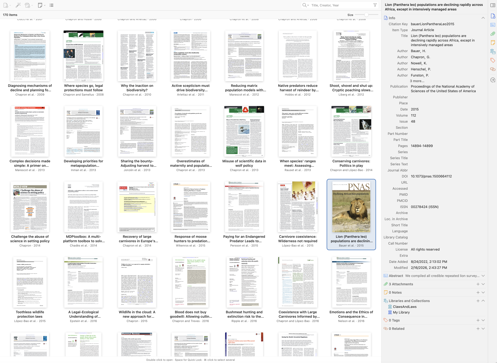

# ZoteroThumbLibrary

A macOS Zotero plugin that replaces the library table with a scrollable grid of first-page PDF thumbnails, EPUB covers, and local image previews. Use the compact view button in the library toolbar to switch between the grid and list.



## Install

Built for **Zotero 9.0.x and 10.0.x**. Version 0.1.9 was tested inside **Zotero 10.0.4 on macOS**, using an isolated profile and synthetic files. Earlier releases were tested inside Zotero 9.0.6; the Zotero 9 collection interface remains supported by a compatibility adapter and portable tests.

1. Open the [latest GitHub release](https://github.com/gchapron/ZoteroThumbLibrary/releases/latest) and download its **ZoteroThumbLibrary `.xpi` asset**. The source-code ZIP and TAR archives are for development and cannot be installed as plugins.
2. In Zotero, choose **Tools → Plugins**.
3. Open the gear menu, choose **Install Plugin From File…**, and select the XPI.
4. Restart Zotero if prompted.

No Python, Node, or developer setup is needed to install the packaged plugin. It can be disabled or removed from Zotero's Plugins window. To update, download and install the newer release's XPI the same way; your existing plugin settings are retained.

## Use

- Each parent item uses its best attachment; standalone attachments have their own cards.
- Collections, saved searches, tags, and quick search use Zotero's existing filtered item view and sort order. Zotero 10 can select several collections or libraries at once; the grid follows the full selection.
- Click to select a card and view its metadata. Double-click or press Enter to open it normally.
- Use ⌘-click or Shift-click for multiple selection, arrow keys to move, and ⌘A to select the displayed items.
- Press the Mac **Delete (⌫)** key above Return to apply Zotero's normal delete action to the selected entries. In the library this moves them to Trash; in a collection it removes them from that collection, including all selected collections in Zotero 10. **⌘Delete** moves collection items to Trash. In Trash, Zotero's permanent-deletion confirmation applies. Native permissions and confirmation dialogs are preserved. Holding the key does not delete successive entries.
- Press **Space** to open or close the selected file in **Zotero7QuickLook**, when a version of that plugin compatible with your Zotero version is installed. Its Escape, ⌘Y, Shift-Space, and Option-Space shortcuts also work from the grid. Previewing preserves the selection and grid focus.
- Drag a card onto a tag in Zotero's bottom-left tag panel to assign that tag. Dragging an already-selected card includes all selected items; dragging an unselected card selects that item first. On macOS, hold **⌘** while dropping to remove the tag.
- Press **1–9** to toggle the corresponding colored tag on the selected items, or **0** to remove their colored tags. Assign colors and shortcut positions in Zotero's tag panel first. Number-pad keys work too. The native Zotero handler determines how mixed selections toggle; Zotero 10 disables these shortcuts when multiple libraries are selected. Read-only libraries cannot be changed. Tag and Delete actions use Zotero 10's native Undo behavior.
- Right-click for Zotero's normal item actions.
- Adjust the **Size** slider to resize cards. Column changes animate while keeping the same item at the top of the viewport. The view choice and card size are remembered.

Switch to list view for sorting columns, expanding multiple attachments, and other table-specific operations. Expanded children are grouped into their parent's card. Disabling the plugin removes its controls and renderer and restores the original list.

## Previews and limits

PDFs, EPUBs, and images must be available locally. Missing attachments are not downloaded automatically. Notes, snapshots, EPUBs without an extractable cover, Office files, encrypted or corrupt PDFs, and files larger than **256 MiB** show a placeholder.

PDF previews use Zotero's bundled PDF.js on every platform, including macOS. Generation stays inside Zotero and does not launch Quick Look processes, eliminating the repeated process activity associated with Dock flickering. No extra software is needed. Version 0.1.9 uses **three independent renderers and PDF.js workers**, reusing each worker between files while releasing document resources after rendering. On supported Zotero builds, PDFs above 512 KiB are read in requested byte ranges instead of copying the entire file just to render page one; PDF.js background fetching is disabled. Smaller PDFs use one local read, avoiding range-request overhead. Some large files can still require most of their contents. The hidden-renderer scheduler avoids the former one-second delay per page. Quick Look is invoked only when you request it through your separate preview plugin.

EPUB covers come directly from the book's declared cover image, including EPUB 3 cover-image metadata, EPUB 2 cover metadata, and cover pages that wrap a raster image in HTML or SVG. They retain the cover's natural proportions without an extra white page around the artwork. Only local archive resources are read; book HTML is not opened or executed.

The plugin does not modify attachment files or annotations. It renders only cards near the visible area, reprioritizes pending work for the current viewport ahead of offscreen preloading, and discards obsolete queued requests when scrolling. A render already in progress finishes and is cached, even if its card has scrolled away. Scroll events are coalesced into animation frames. Returning farther back reattaches the **same loaded image elements**, while source validation runs in the background. Four concurrent cache lookups run independently of new PDF rendering, so slow PDFs cannot hold up saved previews. Requests for the same attachment share one job, including requests from different parent cards. Reduced-motion preferences are respected. Both thumbnail toolbars use a compact 32-pixel row.

Generated previews are retained in a persistent local PNG cache that survives Zotero restarts, limited to **2,000 previews**. Deferred cleanup removes the oldest accessed previews when the limit is exceeded; evicted previews are generated again if revisited. The former 128 MiB and 30-day limits remain removed.

The disk cache and decoded images have different lifetimes. Earlier versions kept only 48 detached cards and created new image elements on distant scroll-back, which could load and decode PNGs again even below the 2,000-file limit. Version 0.1.9 retains up to **2,000 loaded image elements** separately from those 48 cards and pins a recently used decoded working set through Gecko's image API. Pins are limited to **512 MiB of estimated RGBA pixels** and released on eviction or shutdown. This is not a cap on total process memory: compressed images, scaled surfaces, and PDF workers consume additional memory. Images outside the pinned working set remain reusable, but Gecko may decode their pixels again under memory pressure. The DOM stays virtualized, and fallback image strings remain bounded.

The disk cache is stored under `cache/zoteroThumbLibrary/v1` in the Zotero profile directory; existing cached PNGs remain compatible. Source path, attachment ID, file size, and modification time determine the cache key, so changed files get new previews while ordinary metadata edits retain them. Removed or damaged cache files are regenerated, and a filesystem failure falls back to bounded in-memory caching. To reclaim disk space, quit Zotero and remove this cache directory; previews will then be generated again as needed. The first preview of a new or changed file still needs rendering. Each renderer has an independent 30-second timeout; a failed renderer is reset without interrupting the others.

The PDF renderer uses an unthrottled, cancellable scheduler inside its dedicated hidden document; this avoids Gecko's approximately one-second hidden-animation-frame delay without changing page display settings or the visible Zotero window. Earlier isolated testing generated ten simple PDFs in about half a second using this path. Complex scans and vector-heavy files can take longer.

The plugin uses internal Zotero interfaces and permits installation on Zotero 9.0.x and 10.0.x. Its collection adapter supports Zotero 10's multiple selected collections and retains Zotero 9's single-collection interface. Other major versions and operating systems have not been tested. Updates are manual: Zotero requires an HTTPS update URL, so the manifest uses the reserved `updates.invalid` domain without an update service. An update check may fail harmlessly.

## Build and test

The complete plugin source is at the repository root. Build with Python 3 using only its standard library:

```sh
python3 scripts/build.py
```

The script writes the reproducible XPI and `SHA256SUMS.txt` to `dist/`. This generated directory is ignored by Git; installers and checksums are distributed as GitHub Release assets. It packages only the runtime files and license, with fixed ZIP timestamps and permissions. From `dist/`, run `shasum -a 256 -c SHA256SUMS.txt` on macOS to check the package.

Run the dependency-free tests with Node:

```sh
node --test tests/*.test.cjs
```

Tests cover large-library layout bounds, selection, attachment grouping, window reopening, scroll coalescing, zoom anchoring, reuse of 2,000 image elements, decoded-image lock limits and release, reduced motion, native item dragging, colored-tag shortcuts, Delete-key handling and selection continuity, QuickLook shortcut forwarding, EPUB cover extraction, shared attachment jobs, source-file invalidation, the 2,000-file disk limit, cache recovery, independent cache reads during a stalled PDF render, renderer concurrency and per-worker failure isolation, range reads and cancellation, viewport priority, rapid scrolling, and hidden-renderer scheduling.

The current release includes 114 passing portable tests. Compatibility tests cover plural collection contexts, idle refresh detection, collection changes during deletion, native drag cancellation, and tag permissions. Earlier actual Zotero checks exercise card drag events through the native tag panel, multiple selection, Command-drop removal, numbered colored-tag toggling, range-selection anchoring, and the read-only shortcut guard.

`tests/preview-performance-runtime-result.json` records the packaged 0.1.7 checks against 0.1.6 inside headless Zotero 10.0.4 on macOS. Generating 96 distinct tiny synthetic PDFs took **326.5 ms**, versus **5,450.2 ms** before. After traversing 220 attachments, returning to the top immediately displayed decoded cached images with **zero plugin PNG reads or PDF renders**. Cached previews also resolved while a new PDF render was deliberately stalled. These are synthetic timing measurements, not a promise for complex scans or vector-heavy files; verification used the actual DOM and PDF.js renderer, without screenshot-based visual review.

Those earlier engine counters did not measure browser image loads or decoded-surface eviction. The 0.1.9 regression probe, `tests/runtime-preview-rich.js`, also counts image element creation, image load events, and explicit decode calls, and applies memory pressure after traversing 480 image/vector PDFs. It separately benchmarks one versus three renderers and source reads for a large multipage PDF. The fixtures can be regenerated with `tests/make-preview-runtime-fixtures.py`; all integration probes require an isolated synthetic-only profile and must not be run against a personal library.

`tests/preview-rich-runtime-result.json` records the packaged 0.1.9 result: the same image element and identical canvas pixels after scroll-back and memory pressure, with zero new image loads, decode events, or PDF renders. All 480 retained image locks were released on shutdown. Rendering 96 image/vector PDFs took **2.004 s with three renderers versus 2.358 s with one**; 0.1.8 took 2.394 s. A 76.98 MB PDF needed only **6.33 MB of source reads**, taking 19 ms versus 53 ms previously. These are single-machine synthetic measurements. The 480-image working set fits within the decoded-pixel budget; the test does not imply that all 2,000 maximum-size images remain pinned simultaneously.

`tests/zotero10-runtime-result.json` records the 0.1.6 checks inside Zotero 10.0.4: multiple selected collections and libraries, native tagging and Undo/Redo, Delete and Trash Undo, PDF and EPUB previews, cache reuse, zoom continuity, lifecycle cleanup, and a cold restart. The separate QuickLook test copy was limited to Zotero 9, so its integration was not enabled in the Zotero 10 profile; shortcut forwarding remains covered by portable tests.

`tests/runtime-zotero10-*.js` contain integration checks for the guarded disposable development harness and its synthetic fixtures. They are not standalone tests and must not be run against a personal library.

`tests/delete-runtime-result.json` records the 0.1.5 Delete-key checks in a disposable Zotero profile: native confirmation and cancellation, multiple selection, library Trash, collection removal versus Command-Delete, repeat protection, and read-only handling.

`tests/runtime-results.json` preserves the preceding releases' actual Zotero verification using a disposable profile and synthetic files. Checks included a decoded **360 × 466** first-page PNG, native selection, collection filtering, search and empty states, view switching, disable/enable cleanup, main-window reopening, and a cold application restart. Runtime checks inspected live DOM and application state; no screenshot-based visual review was completed. A real library containing 100,000 PDFs was not loaded; large-library bounds were checked by the portable model tests.

## Publish a release

1. Set the intended version in `manifest.json`, update the README, and run the tests and build above.
2. Verify the installer in a disposable Zotero profile and retain the results under `tests/`.
3. Commit and push the source, then create a Git tag matching the manifest version (for example, `v0.1.6`) on that exact commit.
4. Create a draft GitHub Release for the tag, add release notes, and attach the generated XPI and `SHA256SUMS.txt`. Verify the assets before publishing.

The tag preserves the release source; its assets provide the installable package. Keep generated files out of commits.

## Development references

- [Zotero plugin development](https://www.zotero.org/support/dev/client_coding/plugin_development)
- [Zotero 10 plugin migration](https://www.zotero.org/support/dev/zotero_10_for_developers)
- [Zotero plugin lifecycle and reader hooks](https://www.zotero.org/support/dev/zotero_7_for_developers)
- [Zotero source](https://github.com/zotero/zotero)
- [Zotero reader source](https://github.com/zotero/reader)
- [EPUB 3.3 specification](https://www.w3.org/TR/epub-33/)

License: **AGPL-3.0-or-later**. See [LICENSE](LICENSE).
